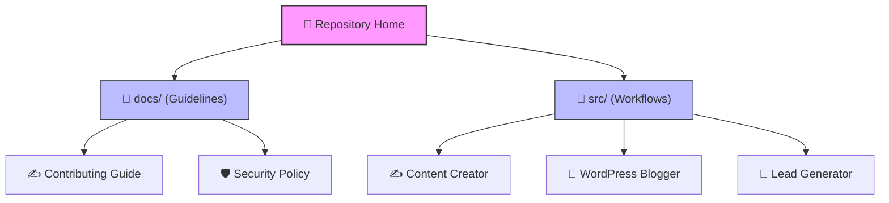

# 🤖 N8N AI Agent Hub

  <b>🏡 Repository Home</b> • 📖 <a href="./docs/README.md">Documentation Hub</a> • 📁 <a href="./src/README.md">Source Packages</a> • 🛡️ <a href="./docs/SECURITY.md">Security Policy</a> • ✍️ <a href="./docs/CONTRIBUTING.md">Contributing Guide</a>

  
  
  
  

---

## 🌟 What is this Repository?

Welcome! This repository is a collection of **production-ready n8n workflows** that act as smart digital helpers (AI Agents) for your business or personal projects. 

If you do repetitive tasks like writing blogs, looking for leads, or posting to social media, these agents are designed to do that work for you automatically.

### 🧠 How does it work?
1. **The Conductor (n8n):** n8n is like a digital coordinator. It connects your website, social media, spreadsheets, and AI models so they can talk to each other.
2. **The Brain (Google Gemini):** We use Google's advanced AI models to read, write, and conceptualize ideas.
3. **The Workers (Workflow Packages):** Each folder in `src/` represents a single automated worker that you can import and run on your own n8n instance.

---

## 🗺️ Repository Structure

Here is how the files are organized in this project. You can click on any folder or file to explore its contents:

---

## 🚀 Available Workflow Packages

| Workflow Agent | Location | What it does (Simple Terms) | Primary Outputs | Status |
| :--- | :--- | :--- | :--- | :--- |
| **✍️ Content Creator** | [`src/contect_creator`](./src/contect_creator) | Turns a topic into a polished article, creates an image description, and prepares draft files. | WordPress draft, LinkedIn post, Google Drive asset | `Active` |
| **🤖 WordPress Blogger** | [`src/wordpress_blogger`](./src/wordpress_blogger) | Reads technology news feeds daily, writes an article in Turkish, generates a cover image, and publishes it. | Live WordPress post | `Active` |
| **🎯 Lead Generator** | [`src/lead_generator`](./src/lead_generator) | Searches Google Maps, filters out business records you already have, and saves new leads. | Clean Google Sheet rows | `Active` |

---

## 🛠️ Quick Start Guide

Setting up your digital assistants is easy:

1. **Clone this workspace** to your local machine.
2. Go to the workflow folder you want inside [`src/`](./src/README.md) and open its setup guide.
3. Import the `agent.json` file into your own **n8n instance**.
4. Configure your private API keys or accounts (e.g. Gemini key, WordPress credentials) inside the n8n nodes.
5. Turn the workflow **ON** and let it do the work!

---

> [!IMPORTANT]
> **Safety First:** The exported workflow JSON files in this repository are sanitized. They do not contain any private API keys, passwords, or personal credentials. Make sure you replace the placeholders with your own keys when configuring them in n8n.

> [!TIP]
> **Want to contribute?** If you have improvements or want to add a new workflow, please read our [Contributing Guide](./docs/CONTRIBUTING.md) first to keep the repository layout clean.
