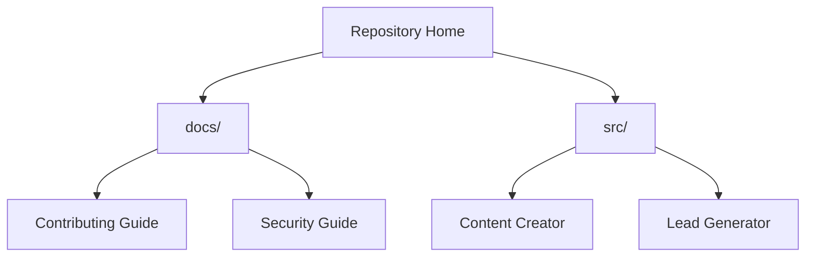

# N8N AI Agent

[Go Docs](docs/README.md) | [Go Source](src/README.md) | [Go Content Creator](src/contect_creator/README.md) | [Go Lead Generator](src/lead_generator/README.md) | [Go Contributing](docs/CONTRIBUTING.md) | [Go Security](docs/SECURITY.md)

This repository collects production-ready n8n workflows for AI-powered content operations and lead generation. Each workflow lives in its own source folder with a dedicated `agent.json` export and a setup-oriented `README.md`.

## Repository Map

## Available Workflows

| Workflow | Path | Purpose | Main Outputs |
| :--- | :--- | :--- | :--- |
| Content Creator | [`src/contect_creator`](src/contect_creator) | Generates blog content, banner prompts, and publishing assets. | WordPress draft, LinkedIn post, Google Drive asset |
| Lead Generator | [`src/lead_generator`](src/lead_generator) | Collects Google Maps leads and appends unique records to Google Sheets. | Lead table rows, success response |

## Quick Start

1. Clone the repository.
2. Open the workflow folder you want under [`src/`](src/README.md).
3. Import the related `agent.json` into n8n.
4. Replace placeholders such as `ENTER_YOUR_API_KEY` with your own credentials inside n8n.
5. Follow the workflow-specific README before activating the flow.

## Documentation

- Start with the [documentation hub](docs/README.md) for the overall structure.
- Use the [source index](src/README.md) to jump between workflow folders.
- Review the [contributing guide](docs/CONTRIBUTING.md) before editing or adding workflows.
- Review the [security guide](docs/SECURITY.md) before exporting or publishing workflow JSON files.

## License

This project is distributed under the MIT License. See [LICENSE](LICENSE) for details.
