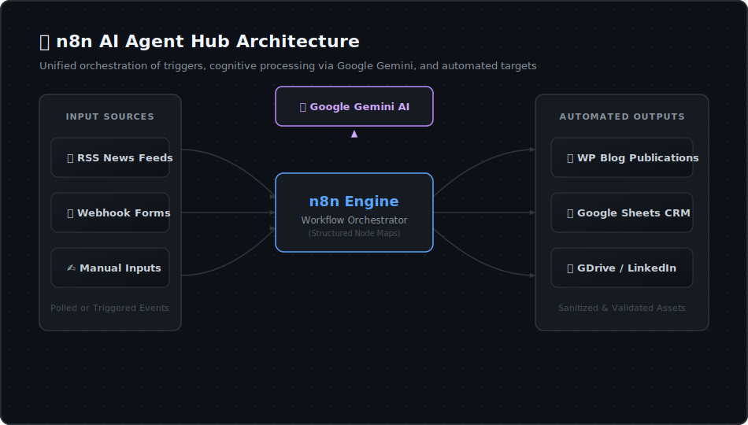
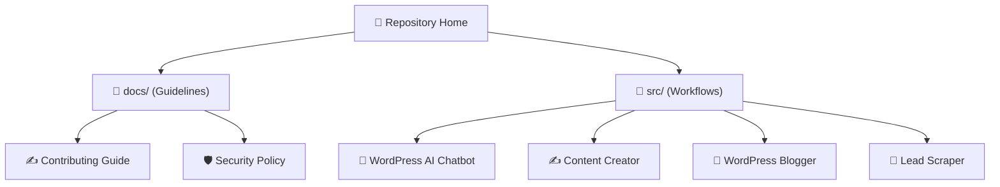

# 🤖 n8n AI Agent Hub

  <b>🏡 Home</b> • 📖 <a href="./docs/README.md">Documentation Hub</a> • 📁 <a href="./src/README.md">Source Packages</a> • 🛡️ <a href="./docs/SECURITY.md">Security Policy</a> • ✍️ <a href="./docs/CONTRIBUTING.md">Contributing Guide</a>

  
  
  
  

---

## 🌟 Overview

Welcome to the **n8n AI Agent Hub**! This repository is a curated collection of production-ready, modular n8n workflow packages designed to automate complex, repetitive digital processes. Powered by **Google Gemini AI**, these automated agents handle content copywriting, web research, database logging, and social publishing on your behalf, acting as intelligent digital workers for your projects.

---

## 🧠 Core Architecture

The hub operates on a three-tier design to ensure high scalability and modularity:

*   **The Orchestrator (n8n):** Serves as the central coordinator, connecting third-party platforms, APIs, database tables, and AI services.
*   **The Intelligence (Google Gemini):** Handles NLP tasks, content copywriting, semantic checks, and text-to-image prompt designing.
*   **The Workers (Workflow Packages):** Standalone, importable directories in `src/` tailored for specific functional operations.

  

---

## 🗺️ Workspace Navigation

Below is a conceptual map of the repository's directories:

---

## 📦 Available Workflow Packages

| Workflow Assistant | Package Path | Operational Summary | Primary Services | Status |
| :--- | :--- | :--- | :--- | :--- |
| **💬 WordPress AI Chatbot** | [`src/wordpress_ai-chatbot`](./src/wordpress_ai-chatbot) | Embeddable web widget backend that acts as an intelligent digital twin for user support and routing. | n8n, Gemini AI, WPCode, HTML5 Widget | `Active` |
| **✍️ Content Creator** | [`src/contect_creator`](./src/contect_creator) | Reads historical posts, drafts SEO articles, writes social copy, and generates cover designs. | n8n, Gemini AI, WordPress, LinkedIn, Google Drive | `Active` |
| **🤖 WordPress Blogger** | [`src/wordpress_blogger`](./src/wordpress_blogger) | Periodically reads technology news RSS feeds, writes SEO articles, generates block-art, and publishes. | n8n, Gemini AI, RSS Feeds, WordPress REST API | `Active` |
| **🎯 Lead Scraper** | [`src/lead_scraper`](./src/lead_scraper) | Searches Google Maps places, filters out duplicate rows in Google Sheets database, and logs new records. | n8n, Google Maps & Places APIs, Google Sheets | `Active` |

---

## 🚀 Quick Start

Deploying a workflow from the hub onto your n8n instance is fast:

1.  **Clone this repository** to your local machine.
2.  Select your target assistant from the [`src/`](./src/README.md) directory and open its documentation.
3.  Download the title-based JSON configuration file (e.g. `wordpress_blogger.json`) inside the package folder.
4.  Go to your **n8n instance** dashboard.
5.  Create a new workflow, click **Import from File**, and select the downloaded JSON file.
6.  Provide your private API keys (e.g. Gemini key, WordPress credentials) inside the n8n credential fields.
7.  Toggle the workflow status to **Active** and run a test build!

---

> [!IMPORTANT]
> **Credential Safety:** The exported workflow JSON configurations are sanitized. Private credentials, passwords, and tokens have been replaced with uppercase placeholders (e.g., `ENTER_YOUR_API_KEY`). Ensure you replace them with your own credentials during setup in n8n.

> [!TIP]
> **Contributions:** If you want to make updates, fix issues, or share a new assistant package, please review the [Contributing Guide](./docs/CONTRIBUTING.md) to maintain repository styling standards.
