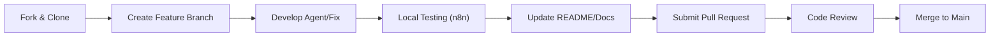

# 🤝 Contributing to N8N AI Agents
### Help Us Build the Future of Autonomous Workflows

Thank you for your interest in contributing! This project thrives on modularity and specialized agent logic. Whether you're fixing a bug, improving an existing agent, or building a brand new one, your contributions are highly valued.

---

## 🛰 Contribution Lifecycle

We follow a standard "Fork & Pull Request" workflow to ensure code quality and system stability.



---

## 🏗 Agent Development Standards

To maintain the "Agentic Mesh" interoperability, all new agents **must** adhere to the following directory structure and documentation standards:

### 1. Directory Structure
```text
src/
└── your_agent_name/
    ├── agent.json    # Exported n8n workflow
    └── README.md     # Comprehensive agent documentation
```

### 2. Documentation Requirements
Your agent's `README.md` must include:
- **Architecture Diagram**: A Mermaid graph showing the internal node logic.
- **Credential Manifest**: List of all required API keys/credentials.
- **Setup Guide**: Step-by-step instructions for any platform-specific configurations (e.g., WordPress App Passwords).
- **Technical Deep Dive**: Explanation of any custom JavaScript or complex logic used.

---

## 🐛 Reporting Bugs

Please use the following template when opening a new issue:

> **Description**: Clear summary of the issue.  
> **Steps to Reproduce**: 1. Import X... 2. Run Y... 3. See Error Z.  
> **Expected vs Actual**: What should have happened vs what did.  
> **Environment**: n8n version, specialized node versions, and browser.

---

## 💡 Feature Requests

We love new agent ideas! When suggesting a feature:
1. Explain the **Business Value** (what problem does this solve?).
2. Outline the **Integration Requirements** (which APIs are needed?).
3. Propose a **High-Level Flow**.

---

## 🔧 Code & Workflow Guidelines

- **Naming Conventions**: Use descriptive, human-readable names for n8n nodes.
- **Credential Safety**: **Never** include active API keys in your `agent.json`. Use placeholder values like `ENTER_YOUR_KEY`.
- **Modularity**: Design agents to be standalone but callable via Webhooks or Execute Workflow nodes.
- **Sanitization**: Include logic to clean LLM outputs (e.g., removing extra markdown) before publishing to external platforms.

---

## 📝 Pull Request Checklist

Before submitting your PR, ensure:
- [ ] Your agent follows the `src/` directory structure.
- [ ] The `agent.json` contains no sensitive data.
- [ ] The Mermaid diagram in your README renders correctly.
- [ ] You have tested the workflow in a clean n8n environment.

---
**Thank you for helping us scale the N8N AI Agent ecosystem! 🚀**
