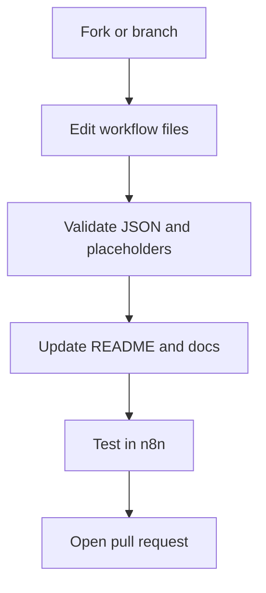

# Contributing Guide

[Back to Docs](./README.md) | [Back to Home](../README.md) | [Go Source](../src/README.md) | [Go Content Creator](../src/contect_creator/README.md) | [Go Lead Generator](../src/lead_generator/README.md) | [Go Security](./SECURITY.md)

This repository favors small, self-contained workflow packages with clear setup notes. If you update a workflow, update the related documentation in the same pass.

## Contribution Flow



## Repository Layout

```text
src/
  contect_creator/
    agent.json
    README.md
  lead_generator/
    agent.json
    README.md
docs/
  README.md
  CONTRIBUTING.md
  SECURITY.md
```

## Documentation Standards

Every workflow README should include:

- A short overview of what the workflow does.
- A compact `graph TD` diagram that is readable on GitHub.
- Setup and credential instructions.
- Operational notes or troubleshooting tips.
- Navigation links back to the rest of the repository docs.

## Workflow Standards

- Use clear node names in n8n exports.
- Replace secrets with placeholders such as `ENTER_YOUR_API_KEY`.
- Keep workflow-specific notes beside the workflow under `src/<workflow>/README.md`.
- Prefer simple diagrams that explain stages instead of every internal node.

## Pull Request Checklist

- [ ] The related `agent.json` has no real secrets.
- [ ] The related README is updated when behavior changes.
- [ ] Mermaid diagrams render cleanly on GitHub.
- [ ] Links between README and docs pages still work.
- [ ] The workflow was reviewed in n8n after export.
