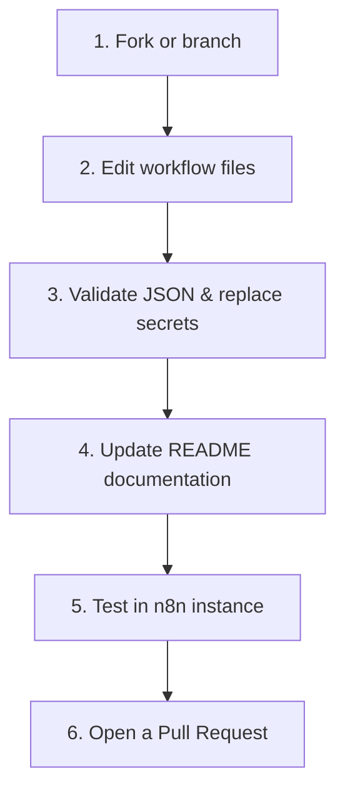

# ✍️ Contributing Guide

<p align="center">
  <b>🏡 <a href="../README.md">Repository Home</a></b> • 📖 <a href="./README.md">Docs Overview</a> • 📁 <a href="../src/README.md">Source Packages</a> • 🛡️ <a href="./SECURITY.md">Security Policy</a> • <b>✍️ Contributing Guide</b>
</p>

---

Thank you for contributing! To keep our repository clean, well-structured, and accessible to the n8n community, we follow a set of layout guidelines and standards when editing or adding new workflows.

---

## 🔄 Contribution Flow

Propose updates and extensions using this flow:



---

## 📁 Repository Layout

The workspace is organized as follows:

```text
src/                          <-- All workflow package directories
  contect_creator/            <-- Content Creator package
    agent.json                <-- Sanitized n8n workflow configuration
    README.md                 <-- Package setup instructions
  wordpress_blogger/          <-- WordPress Blogger package
    agent.json                <-- Sanitized n8n workflow configuration
    README.md                 <-- Package setup instructions
  lead_scraper/               <-- Lead Scraper package
    agent.json                <-- Sanitized n8n workflow configuration
    README.md                 <-- Package setup instructions
docs/                         <-- General guides and policy documents
  README.md                   <-- Documentation hub index
  CONTRIBUTING.md             <-- This file
  SECURITY.md                 <-- Secret & credential handling guidelines
```

---

## 📜 Documentation Standards

Every workflow package directory must contain its own setup **`README.md`**. This setup guide must include:
1. **Overview:** A clear description of the workflow's features and logic.
2. **Operational Diagram:** An SVG graphic or standard TD Mermaid diagram displaying the data flow.
3. **Prerequisites:** A list of third-party APIs, credentials, and configuration targets (e.g. Google Sheets schema).
4. **Step-by-step Setup:** Clear deployment and configuration instructions.
5. **Troubleshooting Table:** Solutions for common errors (e.g., API limits, permission issues).

---

## 🛡️ Workflow Safety Standards

Before saving and submitting a workflow package:
* **Descriptive Node Names:** Avoid default labels. Use descriptive names representing their roles (e.g., `Add Post` instead of `HTTP Request 5`).
* **Sanitize Secrets:** Replace all private API keys, passwords, and custom tokens with generic uppercase placeholders (e.g., `ENTER_YOUR_API_KEY`).
* **Workflow Status:** Set `"active": false` inside the workflow parameters in the JSON file.

---

> [!IMPORTANT]
> **Check Diffs:** Always run `git diff` before committing to ensure you have not accidentally left a live credentials string or sandbox URL in the JSON files.
