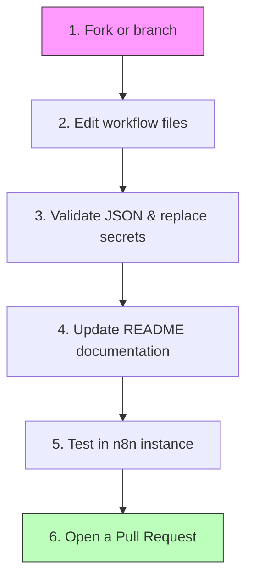

# ✍️ Contributing Guide

<p align="center">
  <b>🏡 <a href="../README.md">Repository Home</a></b> • 📖 <a href="./README.md">Docs Overview</a> • 📁 <a href="../src/README.md">Source Packages</a> • 🛡️ <a href="./SECURITY.md">Security Policy</a> • <b>✍️ Contributing Guide</b>
</p>

---

We love contributions! To keep our repository clean, well-structured, and easy for everyone to use, we follow a simple set of guidelines when making updates. 

Whether you are fixing a typo, updating an existing agent, or adding a brand new workflow, please follow this guide.

---

## 🔄 Contribution Flow

Here is the step-by-step contribution flow to follow:



---

## 📁 Repository Layout

To make it easy to find everything, our workspace follows a strict folder structure:

```text
src/                          <-- Where all workflow folders live
  contect_creator/            <-- Content Creator package
    agent.json                <-- Sanitized n8n workflow file
    README.md                 <-- Setup guide for this specific workflow
  wordpress_blogger/          <-- WordPress Blogger package
    agent.json                <-- Sanitized n8n workflow file
    README.md                 <-- Setup guide for this specific workflow
  lead_generator/             <-- Lead Generator package
    agent.json                <-- Sanitized n8n workflow file
    README.md                 <-- Setup guide for this specific workflow
docs/                         <-- General guides and policies
  README.md                   <-- Documentation hub index
  CONTRIBUTING.md             <-- This file
  SECURITY.md                 <-- Secret & credential policies
```

---

## 📜 Documentation Standards

Every workflow package must have its own **`README.md`** inside its folder. That README must contain:
1. **Overview:** A short explanation of what the workflow does in simple terms.
2. **Workflow Diagram:** A clean, easy-to-read `graph TD` Mermaid diagram showing the workflow blocks.
3. **Prerequisites:** List of services or APIs required (e.g. WordPress account, Gemini key).
4. **Step-by-step Setup:** Clear setup instructions.
5. **Troubleshooting Table:** A list of common problems and how to solve them.

---

## 🛡️ Workflow Safety Standards

Before saving and submitting a workflow:
- **Clean Node Names:** Use descriptive names for your n8n blocks (e.g., `Add Post` instead of `HTTP Request 5`).
- **No Private Secrets:** Ensure you replace all private API keys, passwords, and tokens with uppercase placeholders like `ENTER_YOUR_API_KEY`.
- **Set Inactive by Default:** Set `"active": false` in the workflow settings.

---

> [!IMPORTANT]
> **Check your diffs:** Always check your `git diff` before submitting a Pull Request to make sure you have not left a private password or token inside the `agent.json` files.
