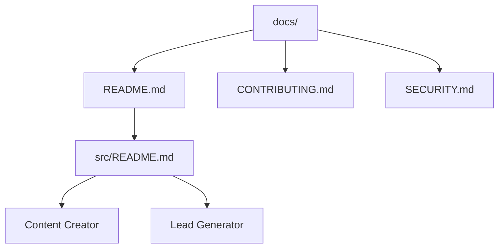

# Documentation Hub

[Back to Home](../README.md) | [Go Source](../src/README.md) | [Go Content Creator](../src/contect_creator/README.md) | [Go Lead Generator](../src/lead_generator/README.md) | [Go Contributing](./CONTRIBUTING.md) | [Go Security](./SECURITY.md)

Use this section as the starting point for repository standards, workflow documentation, and operational guidance. The goal is to keep setup instructions close to each workflow while central guidance lives under `docs/`.

## Documentation Map

## What Lives Here

| Document | Purpose |
| :--- | :--- |
| [README.md](./README.md) | Main documentation index and jump-off point for the repo. |
| [CONTRIBUTING.md](./CONTRIBUTING.md) | Standards for editing workflows, docs, and pull requests. |
| [SECURITY.md](./SECURITY.md) | Rules for secrets, exports, and reporting vulnerabilities. |

## Workflow Entry Points

| Workflow | Summary | Go To |
| :--- | :--- | :--- |
| Content Creator | SEO content generation and publishing flow. | [Go Content Creator](../src/contect_creator/README.md) |
| Lead Generator | Google Maps lead capture and deduplication flow. | [Go Lead Generator](../src/lead_generator/README.md) |

## Recommended Reading Order

1. Start at [Back to Home](../README.md).
2. Open the [source index](../src/README.md).
3. Read the workflow README you want to use.
4. Check [security guidance](./SECURITY.md) before exporting or sharing workflow JSON files.
5. Check [contributing guidance](./CONTRIBUTING.md) before making structural changes.
