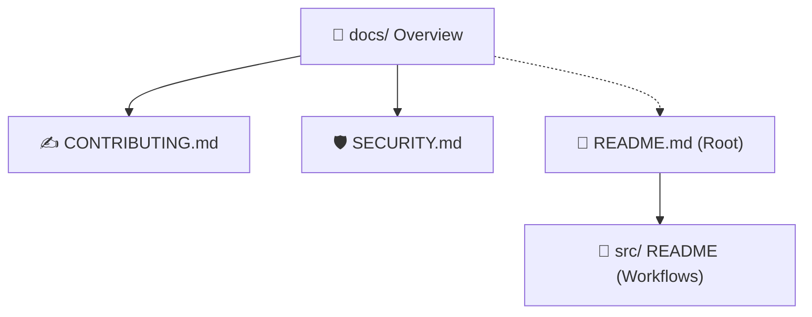

# 📖 Documentation Hub

  <b>🏡 <a href="../README.md">Repository Home</a></b> • <b>📖 Docs Overview</b> • 📁 <a href="../src/README.md">Source Packages</a> • 🛡️ <a href="./SECURITY.md">Security Policy</a> • ✍️ <a href="./CONTRIBUTING.md">Contributing Guide</a>

---

Welcome to the **Documentation Hub**. This section contains the workflow standards, contributing processes, and safety protocols for using and developing packages in this repository.

Individual package setup guides and schemas reside next to their JSON configurations inside the [`src/`](../src/README.md) directory, while global guidelines live here.

---

## 🗺️ Documentation Directory Map

Here is the layout of the repository's guidelines and policy files:

---

## 📚 General Policies & Guides

| Document | Description | Purpose |
| :--- | :--- | :--- |
| **[✍️ Contributing Guide](./CONTRIBUTING.md)** | Guidelines on codebase structure, node naming conventions, and pull request procedures. | Read this before proposing edits or adding new workflows. |
| **[🛡️ Security Policy](./SECURITY.md)** | Standards on secret handling, token sanitization, and vulnerability reporting. | Read this to ensure credentials are never leaked in shared JSON configurations. |

---

## 🚀 Workflow Entry Points

Navigate directly to setup instructions for individual automated agents:

* **✍️ [Content Creator Guide](../src/contect_creator/README.md)** - Generates high-quality articles, cover prompts, and handles asset draft packages.
* **🤖 [WordPress Blogger Guide](../src/wordpress_blogger/README.md)** - Automates news feed consumption, custom copy generation, cover generation, and posts.
* **🎯 [Lead Scraper Guide](../src/lead_scraper/README.md)** - Automates Google Maps places searches, local duplicates filtration, and Google Sheets logging.

---

> [!TIP]
> Always read the **[Security Policy](./SECURITY.md)** before sharing or exporting any custom n8n JSON configuration files to prevent leaking live API keys or passwords.
