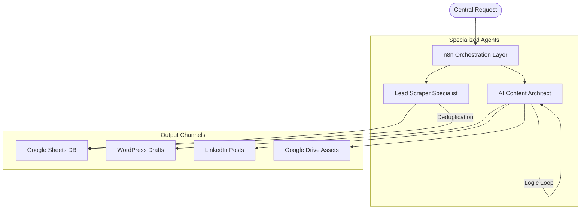

# 🤖 N8N AI Agents Hub
### The Modular Ecosystem for Intelligent Automation

Welcome to the **N8N AI Agents** project. This is a modular, enterprise-grade automated agent ecosystem built on n8n. Our architecture provides a scalable framework for deploying specialized AI agents that handle complex workflows, SEO content generation, lead intelligence, and multi-channel distribution.

---

## 🛰 Ecosystem Architecture

Our "Agentic Mesh" allows specialized agents to operate independently while sharing a unified orchestration layer.

---

## 🤖 Available Agents

| Agent Name | Documentation | Core Function | Status |
| :--- | :--- | :--- | :--- |
| **Lead Scraper Specialist** | [Read More](../src/lead_generator/README.md) | Google Maps scraping with smart deduplication. | ✅ Production |
| **AI Content Architect** | [Read More](../src/contect_creator/README.md) | SEO content writer with image generation. | ✅ Production |

---

## 🚀 Key Framework Features

- **Modular "Plug-and-Play" Architecture**: Add or update specialized agents without disrupting the core system.
- **Intelligent State Management**: Agents use persistent memory to ensure context-aware, non-repetitive actions.
- **Deep Integration Mesh**: Natively connects AI reasoning with WordPress, LinkedIn, Google Cloud, and major CRMs.
- **Standardized Documentation**: Every agent follows a strict documentation protocol including architectural diagrams and setup guides.

---

## 🔧 Getting Started

### 1. Prerequisites
- **n8n Instance**: We recommend a Docker-based setup for production reliability.
- **Google AI Studio Key**: Required for Gemini 2.0 reasoning.
- **API Access**: As required by specific agents (LinkedIn Developers, WordPress App Passwords).

### 2. General Setup
1. **Clone the Hub**: `git clone https://github.com/beydah/N8N-AI-Agent.git`
2. **Environment Variables**: Configure your `.env` file based on our security best practices.
3. **Agent Import**: Choose an agent from the registry above, navigate to its directory, and import the `.json` workflow into your n8n instance.

---

## 🤝 Community & Standards

- **Contributing**: Want to build a new agent? Review our [CONTRIBUTING.md](./CONTRIBUTING.md) for architectural standards.
- **Security**: Security is baked into our design. Read [SECURITY.md](./SECURITY.md) for hardening tips.
- **Wiki**: For advanced enterprise deployment guides, visit our **[Project Wiki](https://github.com/beydah/N8N-AI-Agent/wiki)**.

---
**Developed with ❤️ by [Beydah Saglam](https://github.com/beydah)**
*Transforming business logic into autonomous AI operations.*
