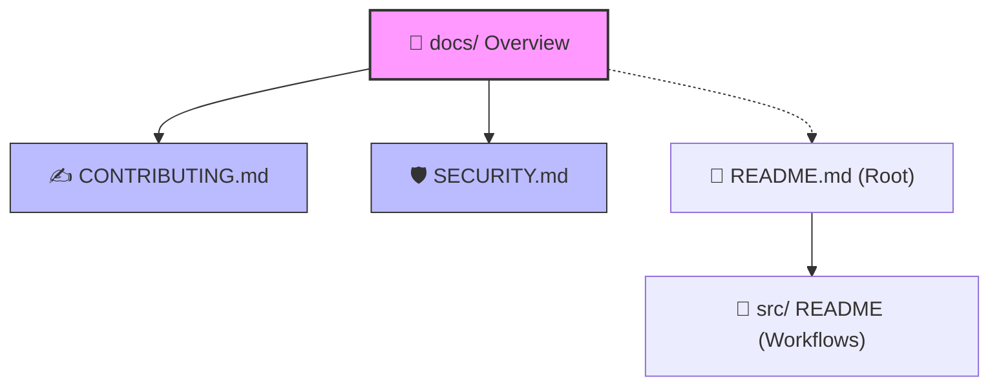

# 📖 Documentation Hub

  <b>🏡 <a href="../README.md">Repository Home</a></b> • <b>📖 Docs Overview</b> • 📁 <a href="../src/README.md">Source Packages</a> • 🛡️ <a href="./SECURITY.md">Security Policy</a> • ✍️ <a href="./CONTRIBUTING.md">Contributing Guide</a>

---

Welcome to the **Documentation Hub**. This section provides the central standards, guidelines, and safety policies for utilizing and extending the workflows in this repository.

To keep things organized, setup guides specific to a workflow are stored right next to their code (inside the `src/` folder), while overall rules and policies live here.

---

## 🗺️ Documentation Directory Map

Here is how the documentation is structured:

---

## 📚 General Guides

| Document | What is it about? (Simple Terms) | Why read it? |
| :--- | :--- | :--- |
| **[✍️ Contributing Guide](./CONTRIBUTING.md)** | Rules for editing workflows, layout standards, and folders. | Read this before creating a pull request or changing node configurations. |
| **[🛡️ Security Policy](./SECURITY.md)** | Guidelines on API keys, secret credentials, and private data. | Read this to ensure you do not leak your credentials when exporting workflows. |

---

## 🚀 Workflow Entry Points

Need help setting up a specific automated agent? Go directly to its setup instructions:

- **✍️ [Content Creator Guide](../src/contect_creator/README.md)** - Generates high-quality blog content and asset draft packages.
- **🤖 [WordPress Blogger Guide](../src/wordpress_blogger/README.md)** - Automates a daily RSS tech news blog writer and cover image publisher.
- **🎯 [Lead Generator Guide](../src/lead_generator/README.md)** - Automates Google Maps business search, deduplication, and Google Sheet logging.

---

> [!TIP]
> Always read the **[Security Policy](./SECURITY.md)** before sharing or exporting any custom n8n JSON files to prevent private API keys from being leaked to public repositories.
