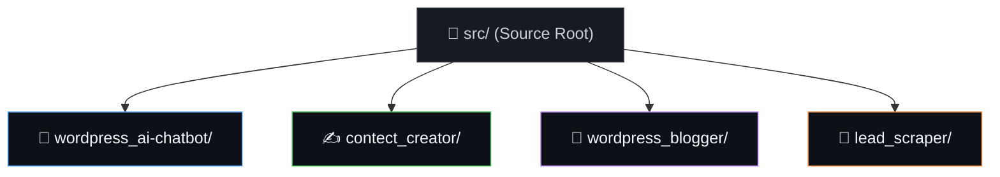

# 📁 Source Packages

  <b>🏡 <a href="../README.md">Repository Home</a></b> • 📖 <a href="../docs/README.md">Documentation Hub</a> • <b>📁 Source Packages</b> • 🛡️ <a href="../docs/SECURITY.md">Security Policy</a> • ✍️ <a href="../docs/CONTRIBUTING.md">Contributing Guide</a>

---

This directory houses the workflow packages available for import into your n8n workspace. To maintain a clean, modular repository layout, each package resides in its own folder and contains its sanitized JSON configuration next to its setup documentation.

---

## 🗺️ Directory Architecture

The source folders are organized as follows:

---

## 📦 Package Catalog

| Package Name | Contents | Description | Integrations |
| :--- | :--- | :--- | :--- |
| **💬 [WordPress AI Chatbot](./wordpress_ai-chatbot/README.md)** | `wordpress_ai-chatbot.json`, `wpcode-footer.html`, `README.md` | Embeddable responsive front-end chat widget and Google Gemini AI Agent with memory support. | n8n, Gemini AI, WordPress (WPCode) |
| **✍️ [Content Creator](./contect_creator/README.md)** | `content_creator.json`, `README.md` | Generates article drafts, cover image prompts, and schedules publishing resources. | n8n, Gemini AI, WordPress, LinkedIn, Google Drive |
| **🤖 [WordPress Blogger](./wordpress_blogger/README.md)** | `wordpress_blogger.json`, `README.md` | Periodically parses tech feeds, writes SEO-friendly articles, drafts voxel cover art, and posts. | n8n, Gemini AI, RSS Feeds, WordPress REST API |
| **🎯 [Google Maps Lead Scraper](./lead_scraper/README.md)** | `lead_scraper.json`, `README.md` | Gathers local business info, runs deduplication logic, and logs unique leads. | n8n, Google Maps & Places APIs, Google Sheets |

---

## 📥 How to Import a Workflow

1.  Click on the package name from the catalog table above.
2.  Review its credential requirements and database schema setup details.
3.  Download its specific JSON configuration file (e.g. `wordpress_blogger.json`).
4.  Go to your **n8n instance** dashboard.
5.  Create a new workflow, click **Import from File**, and select the downloaded JSON file.
6.  Configure your custom API keys, toggle the workflow state to **Active**, and start running!

---

> [!NOTE]
> *Note on directory naming:* The folder name `contect_creator` has been preserved to prevent breaking references in existing automation endpoints.
