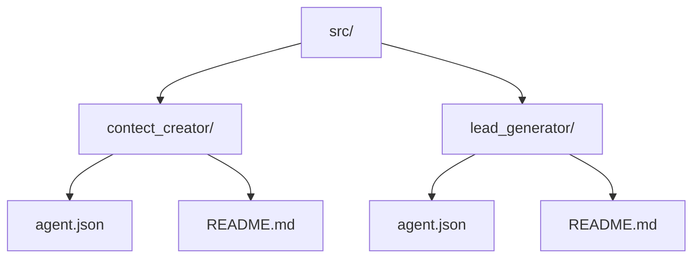

# Source Directory

[Back to Home](../README.md) | [Go Docs](../docs/README.md) | [Go Content Creator](./contect_creator/README.md) | [Go Lead Generator](./lead_generator/README.md) | [Go Contributing](../docs/CONTRIBUTING.md) | [Go Security](../docs/SECURITY.md)

This directory contains the workflow packages that are meant to be imported into n8n. Each package keeps the exported workflow JSON next to its own README so setup, credentials, and operational notes stay close to the actual flow.

## Source Map

## Packages

| Package | Files | Description |
| :--- | :--- | :--- |
| [Content Creator](./contect_creator/README.md) | `agent.json`, `README.md` | Creates content, image prompts, and publishing outputs from a WordPress-driven context flow. |
| [Lead Generator](./lead_generator/README.md) | `agent.json`, `README.md` | Searches Google Maps, filters unique businesses, and appends clean lead records to Google Sheets. |

## Import Workflow

1. Open the package README.
2. Import the matching `agent.json` into n8n.
3. Configure credentials and replace placeholders.
4. Run the workflow in test mode before using production endpoints.

## Notes

- The folder name `contect_creator` is kept as-is to match the current repository structure.
- Sensitive values should never be committed in exported workflow files.
