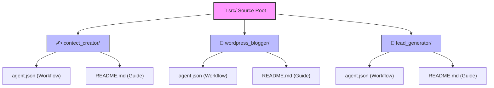

# 📁 Source Packages

  <b>🏡 <a href="../README.md">Repository Home</a></b> • 📖 <a href="../docs/README.md">Documentation Hub</a> • <b>📁 Source Packages</b> • 🛡️ <a href="../docs/SECURITY.md">Security Policy</a> • ✍️ <a href="../docs/CONTRIBUTING.md">Contributing Guide</a>

---

This directory houses the workflow packages that you can import into your n8n instance. 

To keep everything clean and modular, each workflow lives in its own folder and contains its n8n export file (`agent.json`) next to its setup guide (`README.md`).

---

## 🗺️ Source packages directory structure

Here is how the workflow source folders are laid out:

---

## 📦 Available Packages

| Package Name | Files Included | What it does | Primary services used |
| :--- | :--- | :--- | :--- |
| **✍️ [Content Creator](./contect_creator/README.md)** | `agent.json`, `README.md` | Generates article copy, designs an image prompt, and schedules drafts. | n8n, Gemini AI, WordPress, LinkedIn, Google Drive |
| **🤖 [WordPress Blogger](./wordpress_blogger/README.md)** | `agent.json`, `README.md` | Auto-posts news items using AI translation and block-art image generation. | n8n, Gemini AI, RSS Feeds, WordPress REST API |
| **🎯 [Lead Generator](./lead_generator/README.md)** | `agent.json`, `README.md` | Gathers local business info, runs deduplication logic, and logs leads. | n8n, Google Maps & Places APIs, Google Sheets |

---

## 📥 How to Import a Workflow

1. Open the workflow's folder link from the table above.
2. Read the setup requirements.
3. Download the `agent.json` file.
4. Go to your **n8n instance** dashboard.
5. Click **Import from File** and select the downloaded `agent.json`.
6. Add your API credentials and run in test mode first.

---

> [!NOTE]
> *Note on folder spelling:* The folder name `contect_creator` is left as is to ensure compatibility with existing configurations.
