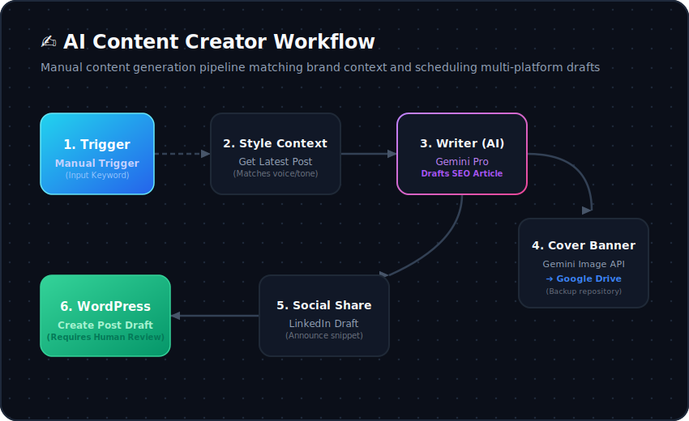

# ✍️ Content Creator

  <b>🏡 <a href="../../README.md">Repository Home</a></b> • 📖 <a href="../../docs/README.md">Docs Overview</a> • 📁 <a href="../README.md">Source Packages</a> • ✍️ <b>Content Creator</b>

  
  
  
  

---

## 🌟 Overview

The **Content Creator** is an automated workspace designed to help content writers draft and schedule articles. Triggered manually, it reads your existing blog to match its branding style, generates fresh, highly structured SEO drafts using Google Gemini, designs alt-banners, creates draft WordPress posts, and compiles LinkedIn announcement copy.

---

## 🚀 Key Features

*   **Brand-Matching Context:** Fetches your latest WordPress posts to capture your writing voice, formatting guidelines, and brand patterns.
*   **AI Writer:** Uses Google Gemini to generate structured SEO articles and matching metadata.
*   **Draft Safety:** Saves the finalized post as a **draft** in WordPress for human review before it goes live.
*   **Social Sharing Assets:** Compiles a professional LinkedIn post draft matching the article.
*   **Asset Backups:** Automatically uploads generated cover banners to Google Drive for safety.

---

## 🗺️ Process Layout

The flowchart below describes the operations inside the content generation workspace:

  

---

## 📁 Package Files

| File | Description |
| :--- | :--- |
| **[`content_creator.json`](./content_creator.json)** | Sanitized n8n workflow configuration file. Import this to your dashboard. |
| **[`content_creator_flow.svg`](./content_creator_flow.svg)** | Visual SVG flow diagram of the process. |

---

## 🛠️ Requirements & Credentials

Before deploying this assistant, verify that you have:

1.  **n8n Instance:** Running self-hosted or cloud version.
2.  **Google Gemini API Key:** Access to Gemini models via [Google AI Studio](https://aistudio.google.com/).
3.  **WordPress REST Credentials:** WordPress site login with Username and Application Password.
4.  **LinkedIn Developer Portal:** App credentials to post to your personal feed or business page.
5.  **Google Drive Integration:** Google Workspace account to upload assets.

---

## ⚙️ Step-by-Step Setup

### 1. Import Workflow
*   Download [`content_creator.json`](./content_creator.json).
*   Go to your n8n workspace, click **Add Workflow** -> **Import from File**, and select the downloaded file.

### 2. Configure Credentials
*   Open the **Gemini nodes** (`Writer`, `Parser`, `Designer`) and add your Google Gemini credentials.
*   Open the **WordPress nodes** (`Get Post`, `Create Blog`) and add your WordPress site REST API credentials.
*   Open the **LinkedIn node** (`Create Post`) and grant n8n OAuth2 permissions to your account.
*   Open the **Google Drive node** (`Upload file`) and connect your target Google Account folder.

### 3. Customize Settings
*   Inside the WordPress HTTP nodes, change the target URLs to point to your live site domain.
*   Adjust directory fields in the Google Drive upload node to your target shared folder path.

---

## 📊 Troubleshooting Guide

| Issue | Root Cause | Resolution |
| :--- | :--- | :--- |
| **Generates similar topics repeatedly** | Sticky or overloaded database memory | Check or clear the `Memory` node context database. |
| **WordPress post draft is empty** | Failed credentials or active category configurations | Verify the `Get Post` node credentials and active category configurations. |
| **Google Drive upload fails** | Directory path issues or expired OAuth token | Verify folder path string names or confirm that n8n has correct OAuth2 write access to Drive. |
| **LinkedIn post fails to publish** | Insufficient developer App scopes | Verify your LinkedIn app has correct developer permissions for user feedback posts. |
