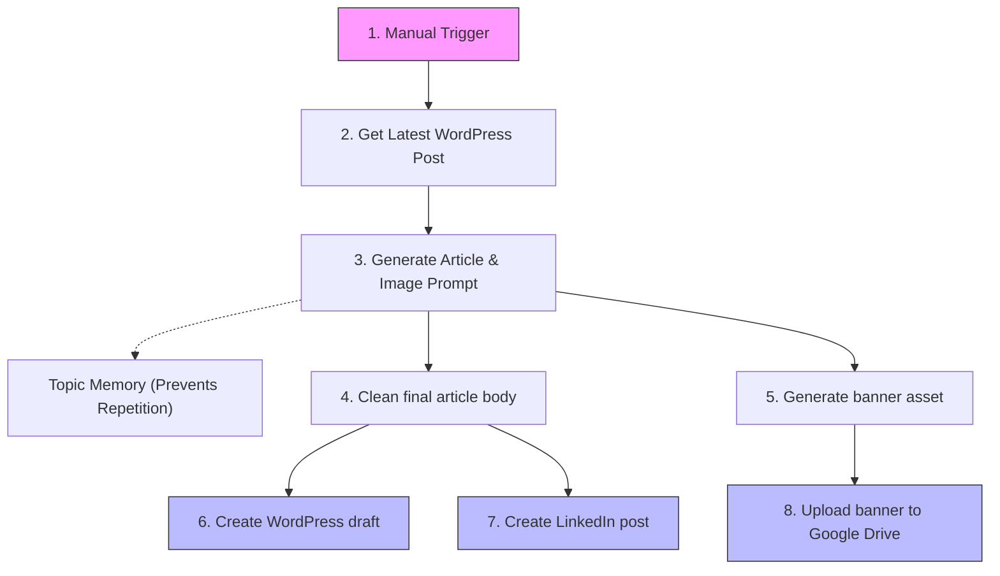

# ✍️ Content Creator Workflow Agent

  <b>🏡 <a href="../../README.md">Repository Home</a></b> • 📖 <a href="../../docs/README.md">Docs Overview</a> • 📁 <a href="../README.md">Source Packages</a> • ✍️ <b>Content Creator</b>

  
  
  
  

---

## 🌟 What is this Workflow?

The **Content Creator** agent is a smart workflow designed to help you create and publish articles easily. 

Give it a topic, and it will:
1. Fetch your latest WordPress post to match the tone and style.
2. Use Google Gemini to draft a fresh, high-quality SEO article.
3. Design a matching image prompt and generate a cover image.
4. Auto-create a WordPress draft post.
5. Auto-draft a LinkedIn post for sharing.
6. Upload the media banner to Google Drive.

---

## 🗺️ Workflow Snapshot

Here is how the automated workflow stages are set up:

---

## 📁 Package Files

| File | What is it? |
| :--- | :--- |
| **[`agent.json`](./agent.json)** | The exported n8n workflow file. Import this to your n8n dashboard. |
| **[`README.md`](./README.md)** | This setup and operational guide. |

---

## 🛠️ Requirements & Credentials

Before starting, make sure you have:
- An **n8n instance** running.
- **Google Gemini API Key** (Create one for free at [Google AI Studio](https://aistudio.google.com/)).
- **WordPress REST API login** (Username & Application Password).
- **LinkedIn Developer account** (for posting updates).
- **Google Drive account** (for asset uploads).

---

## ⚙️ Step-by-Step Setup

### 1. Import to n8n
- Download [`agent.json`](./agent.json) and import it into your n8n workspace.
- Keep the workflow inactive while configuring credentials.

### 2. Set Up Node Credentials

🔑 Click to reveal setup guide for each API

- **Gemini nodes (`Writer`, `Parser`, `Designer`):**
  - Set up Google Gemini API access and select the `models/gemini-2.0-flash` or similar.
- **WordPress nodes (`Get Post`, `Create Blog`):**
  - Select WordPress credentials. Enter your site URL and Application Password.
- **LinkedIn node (`Create Post`):**
  - Connect your LinkedIn OAuth2 account.
- **Google Drive node (`Upload file`):**
  - Select your Google Drive credentials and specify the destination folder.

### 3. Review Content Settings
- Double-check the category filters in the `Get Post` node so it reads from the correct WordPress post category.
- Adjust the output folder destination in the Google Drive `Upload file` node.

---

## 📊 Troubleshooting Guide

| What went wrong? | What should I check? |
| :--- | :--- |
| **Writes about the same topic repeatedly** | Check or reset the `Memory` node. |
| **WordPress post draft is empty** | Verify the `Get Post` node credentials and categories. |
| **Google Drive upload fails** | Verify Google Drive API permissions and check if folder ID exists. |
| **Low-quality blog generation** | Review the prompt instructions inside the `Writer` node. |
