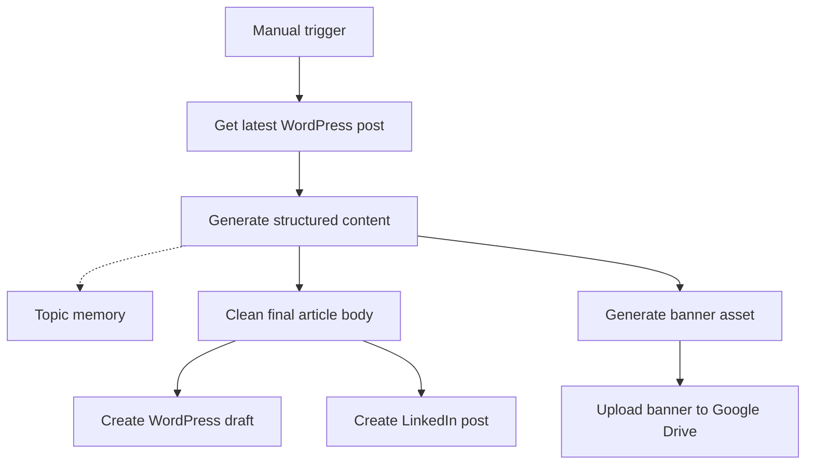

# Content Creator

[Back to Source](../README.md) | [Back to Home](../../README.md) | [Go Docs](../../docs/README.md) | [Go Content Creator](./README.md) | [Go Lead Generator](../lead_generator/README.md) | [Go Contributing](../../docs/CONTRIBUTING.md) | [Go Security](../../docs/SECURITY.md)


This workflow turns a recent WordPress context into a fresh content package. It generates a new article, produces an image prompt, uploads a related asset, and prepares publishing outputs for WordPress and LinkedIn.

## Workflow Snapshot



## What It Does

- Reads the latest post to keep tone and topic direction consistent.
- Uses Gemini-backed generation with structured parsing.
- Prevents repetitive topics through a short memory window.
- Prepares both publishing text and visual asset output in one run.

## Files

| File | Purpose |
| :--- | :--- |
| [`agent.json`](./agent.json) | Exported n8n workflow for import. |
| [`README.md`](./README.md) | Setup and operational guide for this workflow. |

## Required Services

1. n8n instance with the needed community and built-in nodes.
2. Google Gemini credentials.
3. WordPress credentials for reading posts and creating drafts.
4. LinkedIn credentials for publishing updates.
5. Google Drive credentials for uploading generated assets.

## Setup

### 1. Import the Workflow

- Import [`agent.json`](./agent.json) into n8n.
- Review each credential-backed node before running the flow.

### 2. Configure Credentials

- `Writer`, `Parser`, and `Designer` should use your Gemini credentials.
- `Get Post` and `Create Blog` should use your WordPress credentials.
- `Create Post` should use your LinkedIn credentials.
- `Upload file` should use your Google Drive credentials.

### 3. Review Content Settings

- Confirm the `Get Post` category filters match your WordPress setup.
- Confirm the draft status and category behavior in `Create Blog`.
- Confirm the upload folder destination in `Upload file`.

## Output Contract

The workflow expects a structured object with the following keys:

```json
{
  "title": "English blog title",
  "content": "SEO-friendly article body",
  "img_prompt": "Square image prompt",
  "img_title": "url-friendly-slug"
}
```

## Troubleshooting

| Issue | What to Check |
| :--- | :--- |
| Repeated topics | Clear or inspect the memory node. |
| Empty WordPress context | Verify the `Get Post` node credentials and filters. |
| Missing asset upload | Verify Google Drive credentials and folder selection. |
| Low-quality output | Review the prompt and model credentials used by the generation nodes. |

## Related Pages

- [Back to Source](../README.md)
- [Go Lead Generator](../lead_generator/README.md)
- [Go Docs](../../docs/README.md)
