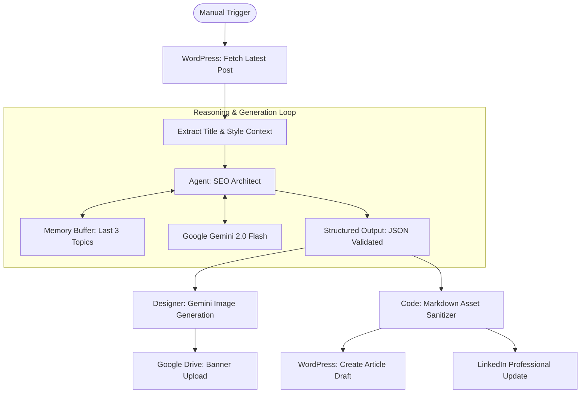

# ✍️ AI Content Architect
### Autonomous SEO Writer & Multi-Channel Publisher (n8n Agent)


**AI Content Architect** is a state-of-the-art agent powered by **Google Gemini 2.0 Flash** and **LangChain**. It automates the entire content lifecycle: analyzing existing context from WordPress, ideating fresh SEO-optimized topics, generating high-fidelity blog text and banners, and distributing them across social and archive channels.

---

## 🛰 Architecture Overview

The agent utilizes a sophisticated "Reasoning Loop" to ensure content variety and technical accuracy.



---

## ✨ Intelligence Features

- **Context-Aware Ideation**: Automatically reads your most recent WordPress post to derive a relevant follow-up topic, ensuring your blog's narrative stays consistent.
- **Advanced Memory Management**: Features a specialized "Memory Rule" that monitors the last 3 topics. If the suggested topic repeats, the AI autonomously generates a new, related category to maintain diversity.
- **Deep SEO Alignment**: Every article is prompted to answer specific user intent: *What is it? How does it work? Advantages? Practical use cases?*
- **Asset Creator**: Uses **Gemini Image Generation** to create professional 1:1 square banners for every post, ensuring visual cohesion.
- **Smart Sanitization**: A custom JavaScript layer removes LLM artifacts (like accidental asterisks or bolding errors) to ensure "Paste-Ready" WordPress drafts.

---

## 🛠 Prerequisites

1. **n8n Instance**: Cloud or self-hosted (v1.x recommended).
2. **AI Keys**: [Google AI Studio (Gemini API)](https://aistudio.google.com/api-keys).
3. **LinkedIn**: Created a Company/Organization page and [App Credentials](https://www.linkedin.com/developers/apps).
4. **WordPress**: Created an Application Password under `Users > Profile`.
5. **Google Cloud**: Service Account or OAuth for [Google Drive API](https://console.cloud.google.com/).

---

## ⚙️ Configuration

### 1. Model Configuration
Locate the **Writer** and **Parser** nodes.
- Enter your Gemini API key in the credentials tab.
- The workflow is pre-configured to use `models/gemini-2.0-flash-lite` for cost efficiency in parsing and `models/gemini-2.0-flash` for high-reasoning writing.

### 2. WordPress Context Sync
Double-click the **Get Post** node.
- Configure your WordPress URL and Application Password.
- Ensure the `categories` filter matches the IDs you wish to analyze.

### 3. Archive & Social Pins
- **Upload file**: Designate a specific folder ID in Google Drive for automated banner archiving.
- **Create Post**: Ensure your LinkedIn person ID (member URN) is updated in the node parameters.

---

## 🧩 Structured Output Schema

The agent enforces a strict JSON schema for zero-integration friction:
```json
{
  "title": "English blog title",
  "content": "SEO-friendly blog body text",
  "img_prompt": "1:1 modern minimalist image prompt",
  "img_title": "url-friendly-slug"
}
```

---

## 📊 Troubleshooting

| Symptom | Cause | Solution |
| :--- | :--- | :--- |
| **Repetitive Topics** | Memory Buffer reset | Clear the node memory or wait for new WordPress context to be fetched. |
| **Markdown Errors** | LLM Hallucinated bolding | The **Clear Content** JS node is designed to catch this; verify the regex pattern. |
| **Image Generation Fail** | Gemini Rate Limits | Ensure your Google AI Studio account is out of standard API tier limits. |

---

## 👨‍💻 Author & Credits

Developed by **Beydah Saglam**
- 🌐 [beydahsaglam.com](https://beydahsaglam.com)
- 🐙 [GitHub Profile](https://github.com/beydah)
- 💼 [LinkedIn](https://linkedin.com/in/beydah)

---
**License:** Distributed under the MIT License. See `LICENSE` for more information.
