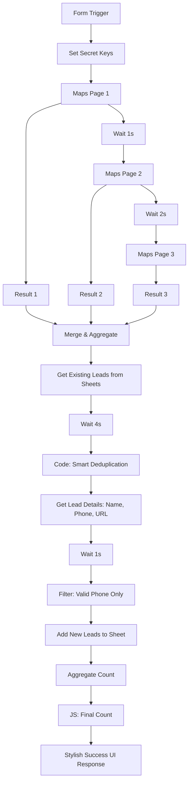

# 🚀 Lead Scraper Specialist
### Advanced Google Maps Lead Generation & Management Workflow (n8n)


**Lead Scraper Specialist** is a high-performance, automated lead generation engine built on **n8n**. It transforms simple keywords into a structured, verified database of business leads by scraping Google Maps, extracting deep contact intelligence, and automatically managing duplicates in Google Sheets.

---

## 🛰 Architecture Overview

The workflow follows a sophisticated ETL (Extract, Transform, Load) pattern designed for reliability and cost-efficiency.



---

## ✨ Premium Features

- **Multi-Page Scraping:** Deep-fetches up to 3 standard pages from Google Maps (approx. 60 businesses) in a single run.
- **Smart Deduplication Logic:** A custom JavaScript engine compares incoming leads against your existing Google Sheet database *before* making expensive API calls for details.
- **Data Enrichment:** Extracts not just the business name, but formatted phone numbers and direct Google Maps URLs.
- **Quality Assurance:** Automatically filters out leads without phone numbers to ensure your sales team only gets actionable data.
- **Responsive Success UI:** Features a custom-coded CSS/HTML interface that provides instant feedback on "Fresh Leads" added.
- **Cost Optimization:** Optimized to stay within the Google Cloud Free Tier (up to 1,000 requests/month).

---

## 🛠 Prerequisites

Ensure you have the following ready before import:

1. **n8n Instance:** Self-hosted or Cloud (v1.x+ required).
2. **Google Cloud Platform (GCP):**
   - Enable **Places API (New)**.
   - Generate an **API Key**.
3. **Google Sheets:**
   - A target spreadsheet with columns: `ID`, `Isletme`, `Telefon`, `Link`, `Durum`.

---

## ⚙️ Configuration & Setup

### 1. The "Secret" Node
Immediately after the `Form Start` node, locate the **Secret** node.
- Update the `API_Google-Maps` value with your GCP API Key.
- Note: It is best practice to move this to n8n Credentials, but for quick setup, this node centralizes your keys.

### 2. Google Sheets Authentication
You must authorize n8n to write to your spreadsheet:
- Open **Get Table** and **Add Table** nodes.
- Select your Google Sheets OAuth2 / Service Account credentials.
- Map the **Document ID** to your specific spreadsheet.
- Ensure the **Sheet Name** matches (default is `TB_Leads`).

### 3. Rate Limit Management
The workflow includes `Wait` nodes (1s to 4s). 
> [!IMPORTANT]
> Do not remove these! They are calibrated to handle Google API pagination tokens and prevent race conditions during the deduplication phase.

---

## 🧠 Technical Breakdown: The Deduplication Engine

The heart of this scraper is the **Code Node**. Instead of just appending data, it performs a surgical check:

```javascript
// Logic:
const seenIds = new Set(existingItems.map(item => item.json.ID));
const uniquePlaceIds = [];

newLeads.forEach(lead => {
  if (lead.place_id && !seenIds.has(lead.place_id)) {
    uniquePlaceIds.push({ json: { place_id: lead.place_id } });
    seenIds.add(lead.place_id); 
  }
});
```
This ensures you never pay for or store the same lead twice, keeping your database clean and your API costs zero.

---

## 🚀 Usage

1. **Activate** the workflow in n8n.
2. Open the **Production URL** of the Form Trigger.
3. Enter your target niche and location (e.g., `Dentist in New York`).
4. Wait for the 🚀 **Done!** screen.
5. Check your Google Sheet for the newly populated rows.

---

## 🛠 Troubleshooting

| Issue | Solution |
| :--- | :--- |
| **0 Results Found** | Check if your API Key has the "Places API" enabled in GCP Console. |
| **Deduplication Errors** | Ensure the `ID` column in Google Sheets matches the `place_id` format exactly. |
| **Timeout** | The workflow may take 15-30 seconds due to `Wait` nodes; this is normal. |

---

## 👨‍💻 Author & Contribution

Developed by **Beydah Saglam**
- 🌐 [beydahsaglam.com](https://beydahsaglam.com)
- 🐙 [GitHub Profile](https://github.com/beydah)
- 💼 [LinkedIn](https://linkedin.com/in/beydah)

*Need a custom n8n agent? Feel free to reach out for high-scale automation solutions.*

---
**License:** Distributed under the MIT License. See `LICENSE` for more information.
