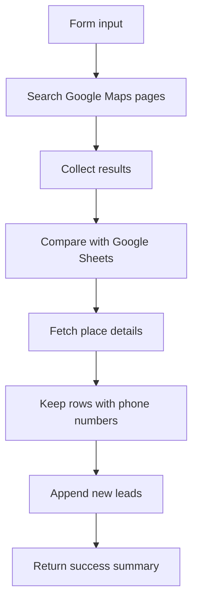

# Lead Generator

[Back to Source](../README.md) | [Back to Home](../../README.md) | [Go Docs](../../docs/README.md) | [Go Content Creator](../contect_creator/README.md) | [Go Lead Generator](./README.md) | [Go Contributing](../../docs/CONTRIBUTING.md) | [Go Security](../../docs/SECURITY.md)

This workflow accepts a keyword from an n8n form, searches Google Maps across multiple pages, removes duplicates against an existing Google Sheet, enriches valid records, and writes only new leads back to the table.

## Workflow Snapshot

## What It Does

- Collects up to three pages of Google Maps search results.
- Consolidates results before running the deduplication logic.
- Compares incoming `place_id` values against existing sheet rows.
- Enriches only new items with business details.
- Returns a final count to the form response.

## Files

| File | Purpose |
| :--- | :--- |
| [`agent.json`](./agent.json) | Exported n8n workflow for import. |
| [`README.md`](./README.md) | Setup and operational guide for this workflow. |

## Required Services

1. n8n instance with form, HTTP, code, wait, merge, and Google Sheets nodes.
2. Google Maps and Places API access.
3. Google Sheets credentials for reading and appending rows.
4. A spreadsheet with `ID`, `Isletme`, `Telefon`, `Link`, and `Durum` columns.

## Setup

### 1. Import the Workflow

- Import [`agent.json`](./agent.json) into n8n.
- Open the `Secret` node and replace `ENTER_YOUR_API_KEY` with your real Google Maps key inside n8n.

### 2. Configure Google Sheets

- Open `Get Table` and `Add Table`.
- Select the correct spreadsheet credentials.
- Confirm the document and sheet names match your target file.

### 3. Keep the Wait Nodes

The workflow uses wait nodes to handle pagination and follow-up API calls safely.

> [!IMPORTANT]
> Do not remove the wait nodes unless you also redesign the request timing and pagination behavior.

## Deduplication Logic

The custom code node builds a `Set` from existing sheet IDs and only forwards unseen `place_id` values. That keeps the workflow from paying for or storing the same lead twice.

## Usage

1. Activate the workflow in n8n.
2. Open the form trigger URL.
3. Submit a search phrase such as `Dentist in New York`.
4. Wait for the success message.
5. Review the new rows in Google Sheets.

## Troubleshooting

| Issue | What to Check |
| :--- | :--- |
| No results | Verify the Google Maps and Places APIs are enabled. |
| Missing rows in Sheets | Verify sheet credentials, document ID, and column mapping. |
| Duplicate leads | Verify the `ID` column stores the `place_id` values consistently. |
| Slow run | Some delay is expected because of the wait nodes. |

## Related Pages

- [Back to Source](../README.md)
- [Go Content Creator](../contect_creator/README.md)
- [Go Docs](../../docs/README.md)
