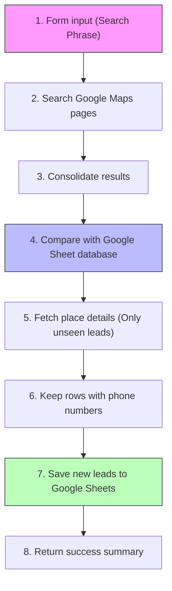

# 🎯 Lead Generator Workflow Agent

  <b>🏡 <a href="../../README.md">Repository Home</a></b> • 📖 <a href="../../docs/README.md">Docs Overview</a> • 📁 <a href="../README.md">Source Packages</a> • 🎯 <b>Lead Generator</b>

  
  
  

---

## 🌟 What is this Workflow?

The **Lead Generator** agent is a smart assistant designed to build business leads lists automatically. 

Give it a search term (like *"Dentist in New York"* or *"Cafes in Berlin"*), and it will:
1. Search Google Maps across multiple pages.
2. Compare the found businesses against your existing Google Sheet database.
3. Skip any businesses you already have (to save you time and API costs).
4. Fetch complete details (phone numbers, website links, coordinates) for *new* businesses.
5. Save the new records directly to your Google Sheet and send a quick run summary.

---

## 🗺️ Workflow Snapshot

Here is the operational process of the lead generator:

---

## 📁 Package Files

| File | What is it? |
| :--- | :--- |
| **[`agent.json`](./agent.json)** | The exported n8n workflow file. Import this to your n8n dashboard. |
| **[`README.md`](./README.md)** | This setup and operational guide. |

---

## 🛠️ Requirements & Database Setup

Before starting, make sure you have:
- An **n8n instance** running.
- **Google Maps & Places API key** with Places API enabled.
- A **Google Sheet** configured with these exact column headers in the first row:
  `ID` • `Isletme` • `Telefon` • `Link` • `Durum`

---

## ⚙️ Step-by-Step Setup

### 1. Import to n8n
- Download [`agent.json`](./agent.json) and import it into your n8n workspace.

### 2. Configure Credentials

🔑 Click to reveal setup guide for each API

- **Google Maps API node (`Secret`):**
  - Open the node and replace the placeholder with your actual Google Maps API key.
- **Google Sheets nodes (`Get Table` & `Add Table`):**
  - Connect your Google account.
  - Select your target spreadsheet and sheet name.

### 3. Keep the Wait Nodes
> [!IMPORTANT]
> The workflow includes wait/delay nodes to stay within Google's API rate limits and request timing policies. Do not delete them.

---

## 💡 How to Use

1. **Activate** the workflow in n8n.
2. Open the form trigger URL generated by n8n.
3. Enter a query (e.g. *"Dentist in New York"*).
4. Wait a couple of minutes for the workflow to complete.
5. Open your Google Sheet to view the clean, enriched list of new business leads!

---

## 📊 Troubleshooting Guide

| What went wrong? | What should I check? |
| :--- | :--- |
| **No leads are being found** | Check if your Google Maps API has billing enabled and the Places API is active. |
| **Google Sheets doesn't write rows** | Verify column header spelling matches: `ID`, `Isletme`, `Telefon`, `Link`, `Durum`. |
| **Duplicate leads appear** | Ensure the `ID` column in your spreadsheet is populated with the Google `place_id` values. |
