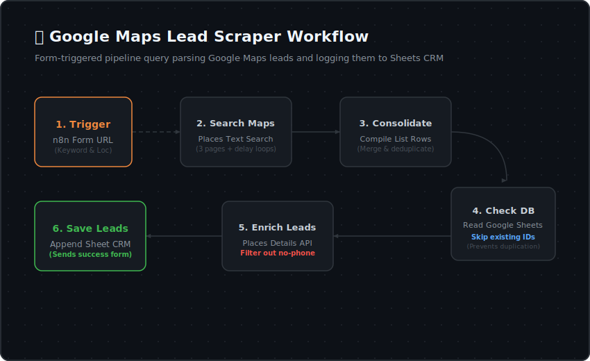

# 🎯 Google Maps Lead Scraper

  <b>🏡 <a href="../../README.md">Repository Home</a></b> • 📖 <a href="../../docs/README.md">Docs Overview</a> • 📁 <a href="../README.md">Source Packages</a> • 🎯 <b>Lead Scraper</b>

  
  
  

---

## 🌟 Overview

The **Lead Scraper** is an automated n8n workflow designed to search Google Maps, extract contact details of target businesses, and log unique leads into a central Google Sheet. It is built to minimize API query costs by skipping duplicate profiles already present in your sheet.

---

## 🚀 Key Features

*   **Flexible Triggering:** Powered by an interactive n8n Form where you can specify Location and Keyword.
*   **Multi-page Scrape:** Pages through up to 3 pages of Maps search results with built-in rate-limiting delays.
*   **Smart Deduplication:** Cross-checks scraped business profiles against the spreadsheet database beforehand.
*   **Data Enrichment:** Enriches leads with coordinates, website links, and formatted phone numbers.
*   **Quality Filter:** Skips leads lacking valid contact phone numbers.

---

## 🗺️ Process Layout

The flowchart below describes the operations inside the lead scraping pipeline:

  

---

## 📁 Package Files

| File | Description |
| :--- | :--- |
| **[`lead_scraper.json`](./lead_scraper.json)** | Sanitized n8n workflow configuration file. Import this to your dashboard. |
| **[`lead_scraper_flow.svg`](./lead_scraper_flow.svg)** | Visual SVG flow diagram of the process. |

---

## 🛠️ Requirements & Database Setup

Before importing this package, prepare your environment:

1.  **n8n Instance:** Running self-hosted or cloud version.
2.  **Google Maps API Key:** Create a project in Google Cloud Console, enable **Places API**, and retrieve an API key.
3.  **Google Sheets Integration:** Connect your Google workspace account to n8n.
4.  **Spreadsheet Structure:** Create a Google Sheet. The first row (headers) must contain the following columns:
    `ID` • `Location` • `Keyword` • `Company` • `Phone` • `Link` • `Date` • `Status`

---

## ⚙️ Step-by-Step Setup

### 1. Import Workflow
*   Download [`lead_scraper.json`](./lead_scraper.json).
*   Go to your n8n workspace, click **Add Workflow** -> **Import from File**, and select the downloaded file.

### 2. Add Credentials
*   Open the **`Variable`** node. In the assignment fields, set the value of the `Key` parameter to your Google Places API Key.
*   Open the Google Sheets nodes (**`Get Table`** and **`Add Table`**):
    *   Select your Google Sheets credentials (or add a new one).
    *   Choose your Spreadsheet and select the Sheet name.

### 3. Delays & Safety Nodes
> [!IMPORTANT]
> The workflow includes **`Wait`** nodes (Wait 1 to Wait 5) between Google Places search pages. These pauses prevent rate-limit errors and ensure compliance with Google Cloud API call policies. Do not delete them.

---

## 💡 Usage Guide

1.  Turn the workflow **ON** in n8n.
2.  Open the **`Form Start`** node web URL.
3.  Enter your target location (e.g. *Chicago, IL*) and search query keyword (e.g. *Plumbing*).
4.  Submit the form. The system will start searching.
5.  The form will redirect to a completion screen once new leads are logged.
6.  Open your Google Sheet to view the parsed and validated business leads!

---

## 📊 Troubleshooting Guide

| Issue | Root Cause | Resolution |
| :--- | :--- | :--- |
| **No items are scraped** | API not enabled or billing inactive | Verify your Google Cloud project has billing enabled and the Places API is active. |
| **Google Sheets writing fails** | Mismatched spreadsheet header strings | Verify that your column headers match the exact casing and names: `ID`, `Location`, `Keyword`, `Company`, `Phone`, `Link`, `Date`, `Status`. |
| **Duplicate entries appear** | Unique ID mapping failure | Make sure the `ID` column in your spreadsheet is populated with the unique Google Maps ID (`place_id`). |
| **API rate limiting errors** | Requests sent too quickly | If Google returns errors, consider increasing the duration in the `Wait` nodes. |
