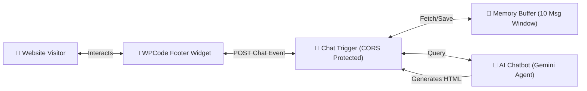

# 💬 WordPress AI Chatbot

  <b>🏡 <a href="../../README.md">Repository Home</a></b> • 📖 <a href="../../docs/README.md">Docs Overview</a> • 📁 <a href="../README.md">Source Packages</a> • 💬 <b>WordPress AI Chatbot</b>

  
  
  
  

---

## 🌟 Overview

The **WordPress AI Chatbot** is a production-ready solution that embeds a premium, responsive AI chat widget onto your WordPress site. The backend is powered by a modular **n8n AI Agent** running Google Gemini (with windowed memory buffer fallback). The assistant is styled entirely in clean HTML structures (grids, cards, progress bars) and acts as an intelligent **digital twin** representing your freelance services, portfolios, and contact routing forms directly to visitors.

---

## 🚀 Key Features

*   **Premium Web UI:** Includes a custom sliding side-panel interface with animations, responsive CSS design, typing indicators, quick actions, and copy-to-clipboard buttons.
*   **Context-Aware Ingestion:** Auto-extracts the current page URL and snippet content on every message, feeding it back to n8n to give the AI real-time page location context.
*   **Interactive Forms:** Renders functional HTML forms for Service Requests, Job Offers, and Custom Inquiries. Submission automatically pre-fills a mailto: envelope with form data.
*   **Confidentiality Safeguards:** Built-in safeguards reject personal or romantic advances politely, and protect company/internal details with confidentiality policies.
*   **Zero External Dependencies:** Built with pure CSS and ES modules loaded securely via standard CDN.

---

## 🗺️ Process Layout

The flowchart below describes the operations inside the chatbot workspace:

---

## 📁 Package Files

| File | Description |
| :--- | :--- |
| **[`wordpress_ai-chatbot.json`](./wordpress_ai-chatbot.json)** | Generalized n8n workflow configuration file. Import this to your dashboard. |
| **[`wpcode-footer.html`](./wpcode-footer.html)** | The standalone HTML/CSS/JS widget snippet. Copy and paste this into your WordPress site footer. |

---

## 🛠️ Requirements & Setup

Before deploying this assistant, verify that you have:

1.  **n8n Instance:** Running self-hosted or cloud version (running over HTTPS).
2.  **Google Gemini API Key:** Access to Gemini models via [Google AI Studio](https://aistudio.google.com/).
3.  **WordPress Plugin:** A header/footer injection plugin like **WPCode** installed on your site.

---

## ⚙️ Step-by-Step Installation

### Step 1: Import Workflow in n8n
1.  Download [`wordpress_ai-chatbot.json`](./wordpress_ai-chatbot.json).
2.  In your n8n workspace, click **Add Workflow** -> **Import from File**, and select the JSON file.
3.  Open the **Model** and **Fallback Model** nodes and set up your Google Gemini credentials.

### Step 2: Configure CORS & Webhook
1.  Double-click the **Chat** (Chat Trigger) node.
2.  Change the **Allowed Origins** setting to your exact site domain names (e.g. `https://yourdomain.com, https://www.yourdomain.com`).
3.  Save the workflow and toggle it to **Active**.
4.  Copy the **Production URL** of the Webhook (e.g. `https://n8n.domain.com/webhook/xxxx-xxxx/chat`).

### Step 3: Configure Footer Widget (WPCode)
1.  Open [`wpcode-footer.html`](./wpcode-footer.html).
2.  Search for the config parameters and customize the placeholders:
    *   Replace `[YOUR_N8N_DOMAIN]` and `[YOUR_WEBHOOK_UUID]` in `webhookUrl` with your copied n8n Webhook URL.
    *   Replace `[YOUR_WEBSITE]` in the logo background URL.
    *   Replace `[YOUR_AI_NAME]` in headings, i18n settings, and welcome notes.
3.  Go to your WordPress Admin -> **Code Snippets** -> **Header and Footer**.
4.  Paste the modified code into the **Footer** text area and click **Save Changes**.

### Step 4: Customize the System Prompt
To make the chatbot speak like you, open the **AI Chatbot** node in n8n and update these specific sections inside the `System Message` text field:
*   **Identity & Philosophy:** Describe your brand tone, coding style, and background.
*   **Allowed URLs:** Enter the exact relative page paths visitors are allowed to navigate to.
*   **FAQ / Projects / Services:** Provide answers to common queries and outline 4 of your key projects or services.

---

## 📊 Troubleshooting Guide

| Issue | Root Cause | Resolution |
| :--- | :--- | :--- |
| **Chat button does not appear** | WPCode snippet not saved or script caching active | Clear your WordPress page cache (WP Rocket, LiteSpeed, etc.) and verify script tags are inside the footer. |
| **"Origin not allowed" / CORS error** | n8n Chat Trigger origin configuration mismatch | Verify that your site URL matches exactly (including `https://` and `www.`) in the Chat node's **Allowed Origins** field. |
| **"Session failed" or 404 on webhook** | Workflow is set to Inactive, or URL is wrong | Ensure your n8n workflow is toggled **ON** and that you used the **Production** Webhook URL instead of the Test URL. |
| **Forms do not trigger mail envelope** | Empty browser mail client association | Form submission relies on local `mailto:` handlers. Advise users that they must have a default email client set up on their OS. |
