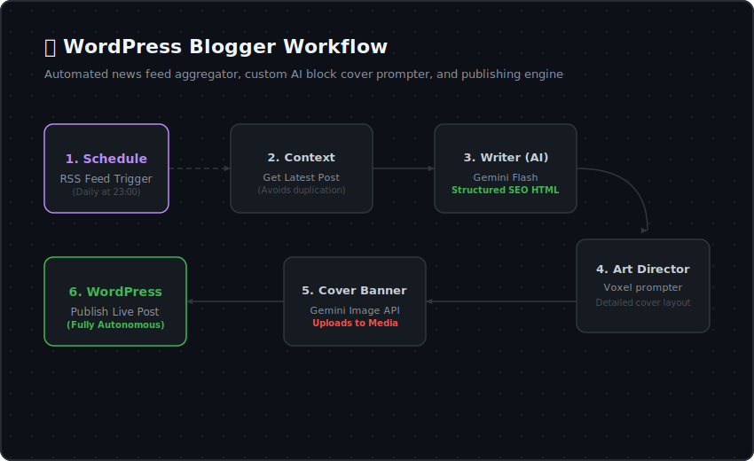

# 🤖 WordPress Blogger

  <b>🏡 <a href="../../README.md">Repository Home</a></b> • 📖 <a href="../../docs/README.md">Docs Overview</a> • 📁 <a href="../README.md">Source Packages</a> • 🤖 <b>WordPress Blogger</b>

  
  
  

---

## 🌟 Overview

The **WordPress Blogger** is a fully automated content publisher. This n8n workflow runs daily to query tech news feeds, contextually write localized, SEO-ready articles, generate customized cover images, and publish live posts to your WordPress site.

### 🧠 Features

1. **Scheduled Runs:** Triggers daily at 23:00 automatically.
2. **Fresh Feed Ingestion:** Pulls active news articles from an RSS feed (e.g. VentureBeat AI category feed).
3. **Contextual Avoidance:** Fetches the latest published article to avoid writing duplicate topics sequentially.
4. **Structured Article Builder:** Generates an article styled with clean HTML headings, comparison tables, and safe interactive accordions.
5. **AI Image Art Director:** Generates voxel-based Minecraft-style cover art tailored directly to the generated article topics.
6. **Instant Publishing:** Connects to WordPress to create tags, upload media, and insert posts cleanly.

---

## 🗺️ Process Layout

The following flowchart describes the operations inside the blogging pipeline:

---

## 📁 Package Files

| File | Description |
| :--- | :--- |
| **[`agent.json`](./agent.json)** | Sanitized n8n workflow configuration file. Import this to your dashboard. |
| **[`wordpress_blogger_flow.svg`](./wordpress_blogger_flow.svg)** | Visual SVG flow diagram of the process. |

---

## 🛠️ Requirements & Credentials

Before deploying this assistant, verify that you have:

1. **n8n Instance:** Running self-hosted or cloud version.
2. **Google Gemini API Key:** Access to Gemini models via [Google AI Studio](https://aistudio.google.com/).
3. **WordPress REST Credentials:** WordPress site login credentials with username and Application Password (create this in WP Admin -> Users -> Profile).

---

## ⚙️ Step-by-Step Setup

### 1. Import Workflow
* Download [`agent.json`](./agent.json).
* Go to your n8n workspace, click **Add Workflow** -> **Import from File**, and select the downloaded file.

### 2. Configure Credentials
* Open the **Gemini nodes** (`First Model`, `Fallback Model`, `Create Img`) and select or create your Google Gemini credentials.
* Open the **WordPress nodes** (`Get Post`, `Add Img`, `Add Key`, `Get Key`, `Add Post`, `Add Post Fallback`) and add/select your WordPress REST API credentials.

### 3. Customize Prompts and Targets
* Open the HTTP Request nodes and edit the WordPress site URLs to replace `https://your-wordpress-site.com` with your live domain address.
* Customize target categories, developer bios, or copywriting rules in the **`Writer`** node under its `systemMessage` parameters.

---

## 📊 Troubleshooting Guide

| Issue | Resolution |
| :--- | :--- |
| **RSS feed node error** | Verify the RSS feed URL is online and formatted correctly. |
| **WordPress upload fails** | Verify that your site URL begins with HTTPS and that Application Passwords are functional. |
| **Cover image fails to generate** | Ensure that the image prompt complies with Gemini content safety filters. |
| **Broken visual layouts in WordPress** | Ensure custom script/style tags are omitted from the AI outputs, as WordPress blocks them. |
