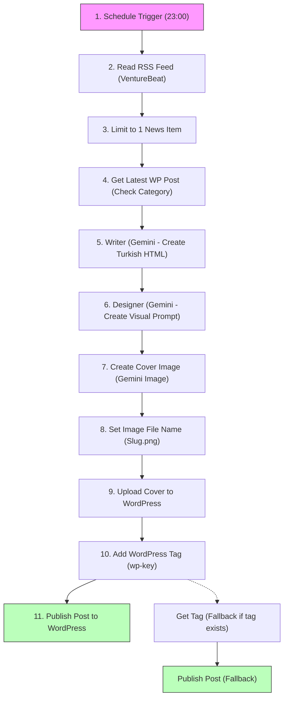

# 🤖 WordPress Blogger Workflow Agent

  <b>🏡 <a href="../../README.md">Repository Home</a></b> • 📖 <a href="../../docs/README.md">Docs Overview</a> • 📁 <a href="../README.md">Source Packages</a> • 🤖 <b>WordPress Blogger</b>

  
  
  

---

## 🌟 What is this Workflow?

The **WordPress Blogger** agent is a fully automated publisher. 

It triggers every day at 23:00 to:
1. Read the latest tech news feed (VentureBeat AI feed).
2. Fetch the latest post on your WordPress blog to ensure it writes about a fresh category.
3. Write a Turkish, SEO-friendly HTML article using Google Gemini.
4. Conceptualize and generate a blocky, Minecraft-style (voxel-art) cover image.
5. Upload the image and publish the post directly to WordPress with custom tags.

---

## 🗺️ Workflow Snapshot

Here is the operational path of the workflow:

---

## 📁 Package Files

| File | What is it? |
| :--- | :--- |
| **[`agent.json`](./agent.json)** | The exported n8n workflow file. Import this to your n8n dashboard. |
| **[`README.md`](./README.md)** | This setup and operational guide. |

---

## 🛠️ Requirements & Credentials

Before starting, make sure you have:
- An **n8n instance** running.
- **Google Gemini API Key** (for text generation and cover image styling).
- **WordPress website REST API login** (Username & Application Password).

---

## ⚙️ Step-by-Step Setup

### 1. Import to n8n
- Download [`agent.json`](./agent.json) and import it into your n8n dashboard.
- Keep the workflow inactive while configuring credentials.

### 2. Set Up Node Credentials

🔑 Click to reveal setup guide for each API

- **Gemini nodes (`First Model`, `Fallback Model`, `Create Img`):**
  - Set up Google Gemini API credentials.
- **WordPress nodes (`Get Post`, `Add Img`, `Add Key`, `Get Key`, `Add Post`, `Add Post Fallback`):**
  - Set up WordPress credentials (`wordpressApi` or `httpBasicAuth`) using your WordPress REST Username and Application Password.

### 3. Customize settings
- **URLs:** Inside the WordPress HTTP nodes, change the `https://beydahsaglam.com/` domain to your own website's domain.
- **System Prompts:** Customize the allowed content categories or target website developer info inside the `Writer` node settings under the systemMessage key.

---

## 📊 Troubleshooting Guide

| What went wrong? | What should I check? |
| :--- | :--- |
| **RSS feed node error** | Check RSS feed URL validation and internet status. |
| **WordPress upload fails** | Verify WordPress credentials and ensure Application Passwords are enabled on your web host. |
| **Cover image fails to generate** | Check Gemini API image quota limits or review prompt content safety flags. |
| **Interactivity styling broken in WP** | Keep custom CSS style tags out of the HTML body, as WordPress blocks them. |
